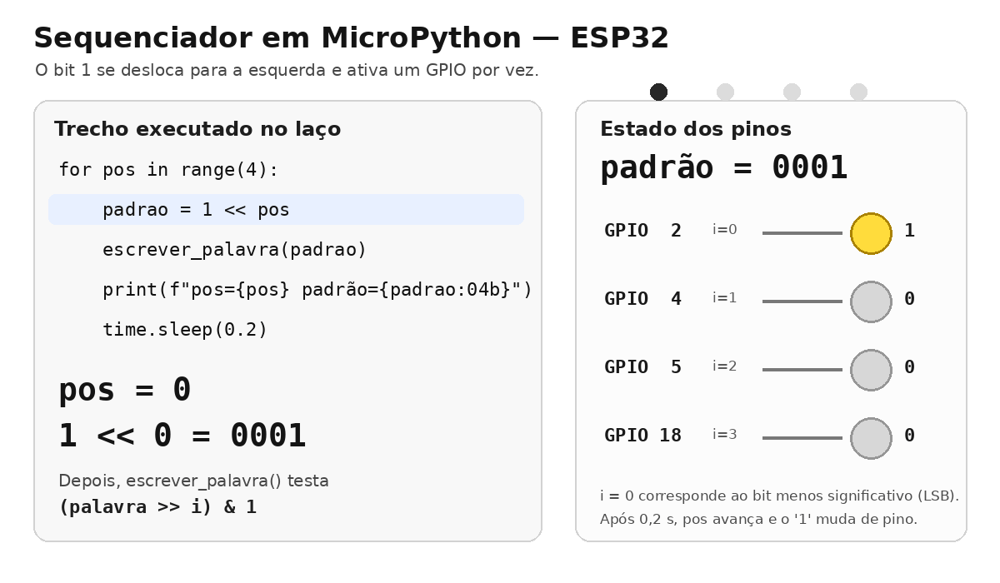

# Aula 4 — Deslocamento de Bits e Escrita Direta em Porta

> **Duração estimada:** 30 minutos  
> **Bloco:** 2 de 3 — Listas, laços e lógica combinatória

---

## Objetivos

Ao final desta aula você será capaz de:

- Usar `<<` e `>>` para deslocar bits e criar padrões sequenciais
- Entender o conceito de palavra binária como representação de múltiplas saídas
- Escrever diretamente no registrador GPIO do ESP32 usando `machine.mem32`
- Comparar a abordagem pino-a-pino com a escrita direta de uma palavra inteira

---

## 1. Conceito

### O que fizemos até aqui — e por que há um limite

Na Aula 3 aprendemos a controlar um banco de 4 LEDs usando uma lista de pinos e um laço `for`. A função `escrever_palavra()` percorria cada pino um a um, extraindo o bit correspondente e aplicando-o individualmente:

```python
def escrever_palavra(palavra):
    for i, pino in enumerate(pinos):
        pino.value((palavra >> i) & 1)   # um pino por vez
```

Isso funciona bem — e é exatamente a abordagem certa para aprender o conceito. Mas observe o que acontece internamente: **os quatro pinos são atualizados em sequência**, um após o outro, em iterações separadas do `for`. Para a maioria dos experimentos isso é imperceptível. Mas imagine uma situação onde isso importa:

> Você está controlando as bobinas de um motor de passo. Cada bobina precisa ser ativada no momento exato certo em relação às outras. Se você atualizar as quatro bobinas em sequência — mesmo que rápido — haverá um instante em que o padrão elétrico está incompleto, e o motor pode tremer ou perder o passo.

Ou ainda:

> Você aciona um display de 7 segmentos multiplexado. Se os segmentos mudam um a um, aparecem piscadas indesejadas na transição entre dígitos.

Nesses casos, o ideal é escrever **todos os pinos de uma só vez**, em uma única instrução. É isso que o registrador `GPIO_OUT` permite.

---

### Deslocamento de bits

O operador `<<` desloca todos os bits de um número para a esquerda, inserindo `0` à direita. O operador `>>` faz o movimento contrário:

```
0b00000001 << 1  =  0b00000010   (bit "caminha" para esquerda)
0b00000100 >> 1  =  0b00000010   (bit "caminha" para direita)
```

Aplicado a LEDs: se cada bit corresponde a um LED, deslocar é fazer o LED "andar".

> **Princípio fundamental:** `1 << N` produz uma palavra com **apenas o bit N em `1`** — todos os outros são `0`. Essa palavra é chamada de **máscara do bit N**. Fazer o OR dessa máscara com qualquer outra palavra **liga o bit N** nessa palavra, sem alterar nenhum outro bit.
>
> ```
> 1 << 3  →  0b00001000          (só o bit 3 vale 1)
>
> palavra   =  0b00000101        (bits 0 e 2 já estavam ligados)
> palavra  |=  0b00001000        (OR com a máscara do bit 3)
>           =  0b00001101        (bit 3 ligado; bits 0 e 2 preservados)
> ```

---

### Escrita direta em porta (registrador GPIO)

O ESP32 possui um registrador de hardware chamado **GPIO_OUT** que armazena o estado de saída de todos os GPIOs ao mesmo tempo. Ele tem 32 bits — e cada bit controla o GPIO de mesmo número:

```
Bit do registrador:   31  ...  18  ...   5   4   ...   2   1   0
GPIO correspondente:  31  ...  18  ...   5   4   ...   2   1   0
```

Escrever um valor nesse registrador atualiza **todos os pinos simultaneamente**, em uma única operação de hardware. Nenhum pino muda antes do outro.

**Endereço do registrador GPIO_OUT no ESP32:**

```python
GPIO_OUT = 0x3FF44004   # registrador de saída GPIO 0–31
```

Para escrever uma palavra de 32 bits nesse registrador:

```python
from machine import mem32
mem32[GPIO_OUT] = palavra
```

**Exemplo direto:** para acender apenas o GPIO2, o bit 2 da palavra deve ser `1` e todos os outros `0`:

```
palavra = 0b00000000_00000000_00000000_00000100
                                              ^
                                          bit 2 = GPIO2
```

Em Python, isso se escreve simplesmente como `1 << 2` — que vale `4` em decimal e tem exatamente o bit 2 em `1`. Para acender **dois GPIOs ao mesmo tempo**, basta combinar duas máscaras com OR:

```
(1 << 2) | (1 << 18)  →  liga o bit 2 E o bit 18, sem tocar nos demais
```

**Regra geral: `palavra |= (1 << N)` liga o bit N em `palavra`, preservando todos os outros.**

```
# ligar o bit 2 (GPIO2) numa máscara que já tem o bit 4 (GPIO4) ligado:
mascara  =  1 << 4   →  0b00010000
mascara |=  1 << 2   →  0b00010100   ← bit 2 ligado; bit 4 intacto
```

> **Raspberry Pi Pico:** o registrador equivalente é `SIO_GPIO_OUT` no endereço `0xD0000010`.  
> `# Pico: GPIO_OUT = 0xD0000010`

---

## 2. Circuito

Mesmo circuito da Aula 3 — 4 LEDs nos GPIOs 2, 4, 5 e 18.

> **Atenção:** na escrita direta via `mem32`, os bits correspondem diretamente aos números dos GPIOs. GPIO2 = bit 2, GPIO4 = bit 4, GPIO5 = bit 5, GPIO18 = bit 18 da palavra de 32 bits. Os bits intermediários (0, 1, 3, 6–17, 19–31) ficam em `0` — os GPIOs correspondentes não são afetados enquanto estiverem configurados como entrada (padrão).

---

## 3. Funcionamento do sequenciador de 4 bits

A animação abaixo mostra como a instrução `1 << pos` desloca o bit `1`,
ativando sequencialmente os GPIOs 2, 4, 5 e 18.



---

## 4. Código

### Parte A — sequenciador com shift (abordagem por lista)

Esta é a mesma abordagem da Aula 3: a função `escrever_palavra()` percorre a lista de pinos com um `for` e atualiza cada um individualmente. O que há de novo aqui é o operador `<<` aplicado ao padrão — em vez de escrever `0b0001`, `0b0010`, `0b0100`, `0b1000` à mão, geramos cada padrão deslocando o bit `1` uma posição por vez. O resultado visual é um LED "caminhando" de um extremo ao outro.

```python
from machine import Pin
import time

pinos = [Pin(2,Pin.OUT), Pin(4,Pin.OUT), Pin(5,Pin.OUT), Pin(18,Pin.OUT)]

def escrever_palavra(palavra):
    for i, pino in enumerate(pinos):
        pino.value((palavra >> i) & 1)

print("Sequenciador — ida")
while True:
    for pos in range(4):
        padrao = 1 << pos          # desloca o bit '1' para a posição pos
        escrever_palavra(padrao)
        print(f"pos={pos}  padrão={padrao:04b}")
        time.sleep(0.2)
```

---

### Parte B — primeiros passos com `mem32`

Antes de construir o sequenciador completo, vamos usar o `mem32` de forma direta para entender exatamente o que está acontecendo.

O programa abaixo executa três passos em sequência, com uma pausa de 1,5 segundo entre cada um:

- **Passo 1:** calcula a máscara para acender apenas o GPIO2 (`1 << 2`), imprime ela no terminal em binário com 32 posições e escreve no registrador — apenas o LED conectado ao GPIO2 acende
- **Passo 2:** combina as máscaras dos bits 2 e 18 com OR (`(1<<2) | (1<<18)`) — **cada `1 << N` liga um bit; o OR reúne os dois numa palavra só** — imprime e escreve no registrador: GPIO2 e GPIO18 acendem **ao mesmo tempo**, com uma única instrução
- **Passo 3:** escreve `0` no registrador — todos os bits vão para `0` e todos os LEDs apagam de uma vez

Acompanhe o terminal enquanto observa os LEDs: você verá a máscara de 32 bits correspondente a cada passo.

```python
from machine import Pin, mem32
import time

# Passo obrigatório: configurar os pinos como saída antes de usar mem32
for gpio in [2, 4, 5, 18]:
    Pin(gpio, Pin.OUT)

GPIO_OUT = 0x3FF44004   # ESP32 — registrador GPIO_OUT (GPIO 0–31)
# Pico: GPIO_OUT = 0xD0000010

# ── Passo 1: acender apenas GPIO2 ─────────────────────────────────
# O bit 2 deve ser 1. Em Python: 1 << 2 = 4 = 0b00000100
mascara = 1 << 2
print(f"Passo 1 — máscara: {mascara:032b}")
#                                    ^ bit 2 = GPIO2
mem32[GPIO_OUT] = mascara
time.sleep(1.5)

# ── Passo 2: acender GPIO2 e GPIO18 ao mesmo tempo ────────────────
# Precisamos dos bits 2 e 18 em '1' simultaneamente.
# Combinamos com OR: (1 << 2) | (1 << 18)
mascara = (1 << 2) | (1 << 18)
print(f"Passo 2 — máscara: {mascara:032b}")
#                            ^ bit 18 = GPIO18
#                                              ^ bit 2 = GPIO2
mem32[GPIO_OUT] = mascara
time.sleep(1.5)

# ── Passo 3: apagar todos ─────────────────────────────────────────
# Todos os bits em 0 → todos os GPIOs de saída em LOW
mascara = 0
print(f"Passo 3 — máscara: {mascara:032b}")
mem32[GPIO_OUT] = mascara
time.sleep(1.5)

print("Primeiros passos concluídos.")
```

> **Observe no terminal:** a máscara impressa tem 32 posições. Os únicos bits em `1`
> são exatamente os que correspondem aos GPIOs que você quer acionar. Todo o resto é `0`.

---

### Parte C — sequenciador via registrador GPIO_OUT

Agora que você viu o `mem32` funcionar de forma simples, vamos montar o sequenciador. O desafio é que nossos LEDs **não estão nos GPIOs 0, 1, 2, 3** — estão nos GPIOs **2, 4, 5 e 18**, que não são consecutivos. Por isso precisamos de uma função que converta a posição lógica do LED (0 a 3) no bit correto do registrador:

```python
from machine import Pin, mem32
import time

# configura pinos como saída (necessário antes de usar mem32)
for gpio in [2, 4, 5, 18]:
    Pin(gpio, Pin.OUT)

GPIO_OUT = 0x3FF44004   # ESP32 — registrador GPIO_OUT (GPIO 0-31)
# Pico: GPIO_OUT = 0xD0000010

# mapa: posição lógica (0..3) → número do GPIO real
gpios = [2, 4, 5, 18]

def montar_mascara(padrao_4bits):
    """Converte 4 bits de posição em máscara de 32 bits para o registrador.

    Exemplo: padrao_4bits = 0b0101 (LED0 e LED2 acesos)
      i=0, gpio=2:  bit 0 de 0b0101 = 1  →  seta bit 2  (GPIO2)
      i=1, gpio=4:  bit 1 de 0b0101 = 0  →  não seta
      i=2, gpio=5:  bit 2 de 0b0101 = 1  →  seta bit 5  (GPIO5)
      i=3, gpio=18: bit 3 de 0b0101 = 0  →  não seta
      resultado: bit2 | bit5 = 0b00000000_00000000_00000000_00100100
    """
    mascara = 0
    for i, gpio in enumerate(gpios):
        if (padrao_4bits >> i) & 1:
            mascara |= (1 << gpio)   # (1 << gpio) liga o bit N=gpio; OR acumula na máscara
    return mascara

print("Sequenciador via mem32 — ida e volta")
sequencia = [1<<i for i in range(4)] + [1<<i for i in range(2,-1,-1)]

while True:
    for padrao in sequencia:
        m = montar_mascara(padrao)
        mem32[GPIO_OUT] = m
        print(f"padrão={padrao:04b}  máscara={m:032b}")
        time.sleep(0.15)
```

---

## 5. Experimento

Execute a **Parte A** e observe o sequenciador.

**a)** Complete a tabela de deslocamento:

| Expressão | Resultado binário | LED aceso |
|-----------|:-----------------:|:---------:|
| `1 << 0` | `0b____` | LED____ |
| `1 << 1` | `0b____` | LED____ |
| `1 << 2` | `0b____` | LED____ |
| `1 << 3` | `0b____` | LED____ |

Execute a **Parte B** e observe o terminal.

**b)** No Passo 2, a máscara combina os bits 2 e 18. Escreva o valor decimal de cada parcela e o resultado final:

- `1 << 2`  = _____ (decimal)
- `1 << 18` = _____ (decimal)
- `(1 << 2) | (1 << 18)` = _____ (decimal)

**c)** No Passo 3 a máscara é `0`. Por que isso apaga **todos** os LEDs de saída e não apenas os que estavam acesos?

> _________________________________________________________________

Execute a **Parte C**.

**d)** O comportamento visual é o mesmo que a Parte A?

> _________________________________________________________________

**e)** Na função `montar_mascara`, quando `padrao_4bits = 0b0101` e `i=2` (gpio=5):
- `(padrao_4bits >> 2) & 1` = `_____`
- `1 << 5` = _____ (decimal)
- Esse bit será setado na máscara? sim / não

**f)** Por que configurar os pinos com `Pin(gpio, Pin.OUT)` antes de usar `mem32` é necessário?

> _________________________________________________________________

---

## 6. Desafio

**Desafio principal:** modifique a Parte A para criar um **sequenciador bidirecional** que vai do LED0 ao LED3 e volta, sem repetir os extremos:

```
LED0 → LED1 → LED2 → LED3 → LED2 → LED1 → LED0 → ...
```

```python
# Dica: monte a sequência com uma lista de valores deslocados
sequencia = ___________________________________________
```

**Desafio bônus:** usando `mem32`, escreva no registrador de forma que dois LEDs acendam simultaneamente com um único `mem32[GPIO_OUT] = ...`. Qual é a máscara que acende GPIO2 e GPIO18 ao mesmo tempo?

```python
mascara = (1 << 2) | (1 << ____)   # complete
mem32[GPIO_OUT] = mascara
```

---

## Resumo da aula

- Na Aula 3, os pinos eram atualizados **um a um** dentro de um `for` — abordagem clara, porém sequencial
- `mem32[endereco] = palavra` escreve 32 bits de uma só vez: todos os GPIOs mudam **no mesmo instante**
- O registrador `GPIO_OUT` usa o número do GPIO como índice do bit — GPIO2 = bit 2, GPIO18 = bit 18
- `1 << N` cria uma palavra com apenas o bit N em `1` — base para montar qualquer máscara
- Combinar máscaras com `|` permite acionar múltiplos GPIOs em uma única escrita
- Escrita direta é mais rápida e atômica — essencial quando o timing entre pinos importa

---

*← [Aula 3](./aula03-listas-mascaras.md) | Próxima → [Aula 5: Máquinas de Estados — Do Diagrama ao Código](./aula05-maquina-estados.md)*
