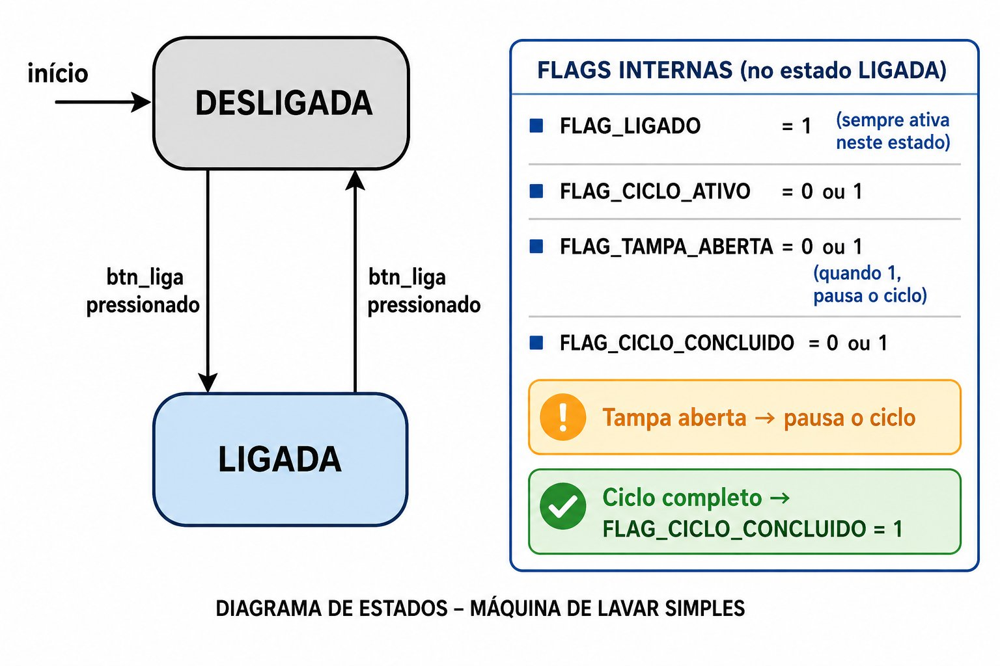

# Aula 6 — Flags na Prática: Máquina de Lavar

> **Duração estimada:** 30 minutos
> **Bloco:** 3 de 3 — Integração e preparação para UART

---

## Objetivos

Ao final desta aula você será capaz de:

- Usar flags de bits para representar condições simultâneas de um sistema
- Setar, limpar e testar flags com `|=`, `&= ~` e `&`
- Combinar flags com uma máquina de estados para controlar comportamento
- Identificar quando usar um estado e quando usar uma flag

---

## 1. Conceito

### Estado vs. Flag — qual a diferença?

Na Aula 5 aprendemos que uma máquina de estados está sempre em **um único estado por vez**. O semáforo nunca está verde e vermelho ao mesmo tempo — ele está em um único estado por vez, e muda de um para outro quando uma condição acontece.

Mas sistemas reais têm situações mais complexas, onde **várias condições podem ser verdadeiras ao mesmo tempo**.

Pense numa máquina de lavar. Ela pode estar:

- **Ligada** — e ao mesmo tempo com a **tampa aberta**
- **Ligada** — e ao mesmo tempo com o **ciclo ativo** e a **tampa fechada**
- **Ligada** — e ao mesmo tempo com o **ciclo concluído** e aguardando o usuário

Essas condições são **independentes entre si**. A tampa pode abrir ou fechar a qualquer momento, independente de o ciclo estar ativo ou não. Criar um estado separado para cada combinação possível seria impraticável — seriam dezenas de estados.

É aí que entram as **flags**: cada flag é um único bit que representa uma condição. Várias flags podem estar ativas ao mesmo tempo, e cada uma pode ser ligada ou desligada sem afetar as outras.

---

### A máquina de lavar desta aula

Nossa máquina de lavar tem **dois estados** e **quatro flags**:

**Estados — onde o sistema está:**

| Estado | Significado |
|--------|-------------|
| `DESLIGADA` | Máquina sem energia — nenhuma flag ativa |
| `LIGADA` | Máquina energizada — flags controlam o que acontece |

**Flags — como o sistema está (dentro do estado LIGADA):**

| Flag | Bit | LED | Significado |
|------|:---:|:---:|-------------|
| `FLAG_LIGADO` | 0 | Verde | Sistema energizado |
| `FLAG_CICLO_ATIVO` | 1 | Azul | Lavagem em andamento |
| `FLAG_TAMPA_ABERTA` | 2 | Amarelo | Tampa aberta — ciclo pausado |
| `FLAG_CICLO_CONCLUIDO` | 3 | Vermelho | Lavagem finalizada |

Representadas em um único byte:

```
Byte de flags:   0b 0 0 0 0  FC  FTA  FCA  FL
                              │    │    │    └── FLAG_LIGADO          (bit 0)
                              │    │    └─────── FLAG_CICLO_ATIVO     (bit 1)
                              │    └──────────── FLAG_TAMPA_ABERTA    (bit 2)
                              └───────────────── FLAG_CICLO_CONCLUIDO (bit 3)
```

**Exemplo de leitura:** se `flags = 0b00000111`, os bits 0, 1 e 2 estão em `1` — significa que a máquina está ligada, o ciclo está ativo e a tampa está aberta (ciclo pausado).

---

### O diagrama da máquina de lavar

O diagrama abaixo mostra os dois estados e as transições. As flags não aparecem como setas — elas vivem *dentro* do estado `LIGADA` e mudam conforme os eventos:

```
                        [btn_liga]
             ┌─────────────────────────────────────────┐
             │                                         │
    início   │                                         │
      ──►  ( DESLIGADA )  ──[btn_liga]──►  ( LIGADA )  │
                                              │         │
                              ┌───────────────┘         │
                              │  Flags internas:        │
                              │  FLAG_LIGADO = 1        │
                              │  FLAG_CICLO_ATIVO       │
                              │    0 → parado           │
                              │    1 → lavando          │
                              │  FLAG_TAMPA_ABERTA      │
                              │    0 → fechada (OK)     │
                              │    1 → aberta (pausa!)  │
                              │  FLAG_CICLO_CONCLUIDO   │
                              │    0 → em andamento     │
                              │    1 → finalizado       │
                              └─────────────────────────┘
```

> **Leitura do diagrama:**
> - O círculo `( DESLIGADA )` é o estado inicial — indicado pela seta `──►`
> - A seta `──[btn_liga]──►` indica que pressionar o botão muda de estado
> - Dentro de `( LIGADA )`, as flags mudam conforme os eventos (tampa, tempo de ciclo)
> - Pressionar `btn_liga` novamente retorna para `DESLIGADA` e limpa todas as flags



---

### Operações sobre flags

Cada flag é manipulada de forma independente com três operações:

| Intenção | Operação | Efeito no byte |
|----------|----------|----------------|
| Ligar flag | `flags \|= FLAG_X` | Seta apenas o bit da flag, preserva os demais |
| Desligar flag | `flags &= ~FLAG_X` | Limpa apenas o bit da flag, preserva os demais |
| Alternar flag | `flags ^= FLAG_X` | Inverte o bit — útil para botão de abrir/fechar |
| Testar flag | `flags & FLAG_X` | Retorna valor não-nulo se a flag estiver ativa |

**Exemplo passo a passo:**

```python
flags = 0b00000000        # início: tudo inativo

flags |= FLAG_LIGADO      # liga →  0b00000001
flags |= FLAG_CICLO_ATIVO # ciclo → 0b00000011
flags ^= FLAG_TAMPA_ABERTA # abre → 0b00000111  (ciclo pausado)
flags ^= FLAG_TAMPA_ABERTA # fecha →0b00000011  (ciclo retoma)

# testar se o ciclo pode avançar:
if (flags & FLAG_CICLO_ATIVO) and not (flags & FLAG_TAMPA_ABERTA):
    print("Lavando...")   # só entra aqui se ciclo ativo E tampa fechada
```

---

## 2. Circuito

| Componente | Quantidade |
|------------|------------|
| ESP32 DevKit | 1 |
| LED (qualquer cor) | 4 |
| Resistor 220 Ω | 4 |
| Botão (pushbutton) | 2 |
| Resistor 10 kΩ | 2 |

**Conexões:**

```
GPIO2  ──► R220 ──► LED_LIGADO        ──► GND   (Flag 0 — sistema ligado)
GPIO4  ──► R220 ──► LED_CICLO_ATIVO   ──► GND   (Flag 1 — ciclo em andamento)
GPIO5  ──► R220 ──► LED_TAMPA_ABERTA  ──► GND   (Flag 2 — tampa aberta)
GPIO18 ──► R220 ──► LED_CONCLUIDO     ──► GND   (Flag 3 — ciclo concluído)

GPIO13 ──► Botão LIGA/DESLIGA ──► 3,3V | GPIO13 ──► 10kΩ ──► GND
GPIO14 ──► Botão TAMPA        ──► 3,3V | GPIO14 ──► 10kΩ ──► GND
```

```
# Pico: LEDs em GPIO 0,1,2,3 | Botões em GPIO 14,15
```

---

## 3. Circuito Wokwi — diagram.json

```json
{
  "version": 1,
  "author": "RMB - Mini Curso Embarcados — Aula 6",
  "editor": "wokwi",
  "parts": [
    { "type": "wokwi-esp32-devkit-v1", "id": "esp", "top": 0, "left": 0, "attrs": {} },
    { "type": "wokwi-led", "id": "led0", "top": 20, "left": 240, "attrs": { "color": "green"  } },
    { "type": "wokwi-led", "id": "led1", "top": 20, "left": 278, "attrs": { "color": "blue"   } },
    { "type": "wokwi-led", "id": "led2", "top": 20, "left": 316, "attrs": { "color": "yellow" } },
    { "type": "wokwi-led", "id": "led3", "top": 20, "left": 354, "attrs": { "color": "red"    } },
    { "type": "wokwi-resistor", "id": "r0", "top": 100, "left": 235, "rotate": 90, "attrs": { "value": "220" } },
    { "type": "wokwi-resistor", "id": "r1", "top": 100, "left": 273, "rotate": 90, "attrs": { "value": "220" } },
    { "type": "wokwi-resistor", "id": "r2", "top": 100, "left": 311, "rotate": 90, "attrs": { "value": "220" } },
    { "type": "wokwi-resistor", "id": "r3", "top": 100, "left": 349, "rotate": 90, "attrs": { "value": "220" } },
    { "type": "wokwi-pushbutton", "id": "btnL", "top": 180, "left": 200, "attrs": { "color": "green"  } },
    { "type": "wokwi-pushbutton", "id": "btnT", "top": 180, "left": 310, "attrs": { "color": "yellow" } },
    { "type": "wokwi-resistor",   "id": "rpL", "top": 220, "left": 160, "rotate": 90, "attrs": { "value": "10000" } },
    { "type": "wokwi-resistor",   "id": "rpT", "top": 220, "left": 270, "rotate": 90, "attrs": { "value": "10000" } }
  ],
  "connections": [
    [ "esp:2",  "r0:2", "green",  [] ], [ "r0:1", "led0:A", "green",  [] ], [ "led0:K", "esp:GND.1", "black", [] ],
    [ "esp:4",  "r1:2", "blue",   [] ], [ "r1:1", "led1:A", "blue",   [] ], [ "led1:K", "esp:GND.1", "black", [] ],
    [ "esp:5",  "r2:2", "yellow", [] ], [ "r2:1", "led2:A", "yellow", [] ], [ "led2:K", "esp:GND.1", "black", [] ],
    [ "esp:18", "r3:2", "red",    [] ], [ "r3:1", "led3:A", "red",    [] ], [ "led3:K", "esp:GND.1", "black", [] ],
    [ "esp:13", "btnL:1.l", "green",  [] ], [ "btnL:2.l", "esp:3V3", "red", [] ],
    [ "btnL:1.l", "rpL:1", "green", [] ], [ "rpL:2", "esp:GND.1", "black", [] ],
    [ "esp:14", "btnT:1.l", "yellow", [] ], [ "btnT:2.l", "esp:3V3", "red", [] ],
    [ "btnT:1.l", "rpT:1", "yellow", [] ], [ "rpT:2", "esp:GND.1", "black", [] ]
  ],
  "dependencies": {}
}
```

> **Atenção:** este `diagram.json` é uma sugestão de ponto de partida.
> Valide e ajuste as conexões no Wokwi antes de usar com os alunos.

---

## 4. Código

```python
# ============================================================
# Aula 6 — Flags na Prática: Máquina de Lavar
#
# Flags representam condições simultâneas do sistema.
# Uma máquina de estados simples (DESLIGADA / LIGADA)
# controla o fluxo principal; as flags detalham o
# comportamento interno no estado LIGADA.
#
# Botão LIGA (GPIO13): liga / desliga a máquina
# Botão TAMPA (GPIO14): simula abrir / fechar a tampa
#
# LEDs:
#   GPIO2  → FLAG_LIGADO        (verde)
#   GPIO4  → FLAG_CICLO_ATIVO   (azul)
#   GPIO5  → FLAG_TAMPA_ABERTA  (amarelo)
#   GPIO18 → FLAG_CICLO_CONCLUIDO (vermelho)
# ============================================================

from machine import Pin
import time

# --- pinos ---
led_ligado     = Pin(2,  Pin.OUT)
led_ciclo      = Pin(4,  Pin.OUT)
led_tampa      = Pin(5,  Pin.OUT)
led_concluido  = Pin(18, Pin.OUT)

btn_liga  = Pin(13, Pin.IN)   # pull-down externo
btn_tampa = Pin(14, Pin.IN)   # pull-down externo

# Pico: led_ligado=Pin(0,OUT) | led_ciclo=Pin(1,OUT)
# Pico: led_tampa=Pin(2,OUT)  | led_concluido=Pin(3,OUT)
# Pico: btn_liga=Pin(14,IN)   | btn_tampa=Pin(15,IN)

# --- definição das flags ---
FLAG_LIGADO          = 0b00000001   # bit 0
FLAG_CICLO_ATIVO     = 0b00000010   # bit 1
FLAG_TAMPA_ABERTA    = 0b00000100   # bit 2
FLAG_CICLO_CONCLUIDO = 0b00001000   # bit 3

# --- estados da máquina ---
DESLIGADA = 0
LIGADA    = 1

# --- variáveis de controle ---
estado = DESLIGADA
flags  = 0b00000000      # todas as flags inativas no início
tempo_ciclo = 8          # duração do ciclo em segundos (simulado)

# --- funções auxiliares ---
def aplicar_leds(f):
    """Reflete o byte de flags nos LEDs."""
    led_ligado.value(1    if f & FLAG_LIGADO          else 0)
    led_ciclo.value(1     if f & FLAG_CICLO_ATIVO     else 0)
    led_tampa.value(1     if f & FLAG_TAMPA_ABERTA    else 0)
    led_concluido.value(1 if f & FLAG_CICLO_CONCLUIDO else 0)

def print_flags(f):
    """Exibe o estado atual das flags no terminal."""
    print(f"flags = 0b{f:08b}")
    print(f"  LIGADO={bool(f & FLAG_LIGADO)}"
          f"  CICLO={bool(f & FLAG_CICLO_ATIVO)}"
          f"  TAMPA={bool(f & FLAG_TAMPA_ABERTA)}"
          f"  CONCLUIDO={bool(f & FLAG_CICLO_CONCLUIDO)}")

def btn_pressionado(btn):
    """Lê botão com debounce simples."""
    if btn.value():
        time.sleep_ms(20)
        return btn.value()
    return False

# --- estado inicial ---
aplicar_leds(flags)
print("Máquina de lavar — aguardando...")
print("Botão VERDE: liga/desliga | Botão AMARELO: tampa")

# --- loop principal ---
while True:

    # ── DESLIGADA ─────────────────────────────────────────────────
    if estado == DESLIGADA:
        if btn_pressionado(btn_liga):
            # liga a máquina: seta FLAG_LIGADO e inicia ciclo
            flags |= FLAG_LIGADO           # liga
            flags |= FLAG_CICLO_ATIVO      # inicia ciclo
            flags &= ~FLAG_CICLO_CONCLUIDO # limpa conclusão anterior
            estado = LIGADA
            inicio_ciclo = time.time()
            aplicar_leds(flags)
            print("\n[LIGADA] Ciclo iniciado.")
            print_flags(flags)
            time.sleep_ms(300)             # debounce

    # ── LIGADA ────────────────────────────────────────────────────
    elif estado == LIGADA:

        # botão TAMPA: alterna flag de tampa aberta / fechada
        if btn_pressionado(btn_tampa):
            flags ^= FLAG_TAMPA_ABERTA     # toggle: abre ou fecha
            if flags & FLAG_TAMPA_ABERTA:
                print("[TAMPA] Aberta — ciclo pausado!")
            else:
                print("[TAMPA] Fechada — ciclo retomado.")
            aplicar_leds(flags)
            print_flags(flags)
            time.sleep_ms(300)

        # botão LIGA: desliga a máquina
        if btn_pressionado(btn_liga):
            flags = 0b00000000             # limpa todas as flags
            estado = DESLIGADA
            aplicar_leds(flags)
            print("\n[DESLIGADA] Máquina desligada.")
            time.sleep_ms(300)

        # progresso do ciclo — só avança se tampa estiver fechada
        if (flags & FLAG_CICLO_ATIVO) and not (flags & FLAG_TAMPA_ABERTA):
            tempo_decorrido = time.time() - inicio_ciclo
            if tempo_decorrido >= tempo_ciclo:
                # ciclo concluído
                flags &= ~FLAG_CICLO_ATIVO      # encerra ciclo
                flags |= FLAG_CICLO_CONCLUIDO   # sinaliza conclusão
                aplicar_leds(flags)
                print("\n[CONCLUÍDO] Ciclo finalizado!")
                print_flags(flags)

    time.sleep_ms(50)   # cadência do loop
```

---

## 5. Experimento

Execute o código e siga a sequência abaixo, observando os LEDs e o terminal a cada passo.

**a)** Complete a tabela conforme você executa cada ação:

| Ação | `flags` em binário | LEDs acesos |
|------|--------------------|-------------|
| Início (desligada) | `0b00000000` | nenhum |
| Pressiona LIGA | `0b________` | _______ |
| Pressiona TAMPA (abre) | `0b________` | _______ |
| Pressiona TAMPA (fecha) | `0b________` | _______ |
| Aguarda ciclo concluir | `0b________` | _______ |
| Pressiona LIGA (desliga) | `0b________` | _______ |

**b)** Quando a tampa está aberta, o LED de ciclo apaga? Por que ou por que não?

> _________________________________________________________________
> _________________________________________________________________

**c)** A linha `flags ^= FLAG_TAMPA_ABERTA` usa o operador XOR. O que ele faz aqui que `|=` não faria?

> _________________________________________________________________
> _________________________________________________________________

**d)** A linha `flags &= ~FLAG_CICLO_CONCLUIDO` usa `~` (NOT). Explique por que não é possível usar `flags &= 0` para limpar apenas essa flag:

> _________________________________________________________________
> _________________________________________________________________

**e)** Ao desligar a máquina, o código faz `flags = 0b00000000`. Por que não usar `flags &= ~FLAG_LIGADO` nesse momento?

> _________________________________________________________________

---

## 6. Desafio

**Desafio principal:** adicione uma flag `FLAG_ENXAGUE` (bit 4) que é setada automaticamente quando o ciclo principal termina. O enxague dura 4 segundos, e só após ele terminar a flag `FLAG_CICLO_CONCLUIDO` é ativada:

```python
FLAG_ENXAGUE = 0b00010000   # bit 4

# modifique o bloco de conclusão do ciclo:
if tempo_decorrido >= tempo_ciclo:
    flags &= ~FLAG_CICLO_ATIVO
    flags |= FLAG_ENXAGUE          # inicia enxague
    inicio_enxague = time.time()
    print("\n[ENXAGUE] Iniciado...")
    aplicar_leds(flags)

# adicione verificação do enxague:
if flags & FLAG_ENXAGUE:
    if time.time() - inicio_enxague >= 4:
        flags &= ~FLAG_ENXAGUE
        flags |= FLAG_CICLO_CONCLUIDO
        print("[CONCLUÍDO] Enxague finalizado!")
        aplicar_leds(flags)
```

**Desafio bônus:** crie uma função `flags_ativas(f)` que retorne uma lista com os nomes das flags ativas:

```python
def flags_ativas(f):
    mapa = {
        FLAG_LIGADO:          "LIGADO",
        FLAG_CICLO_ATIVO:     "CICLO_ATIVO",
        FLAG_TAMPA_ABERTA:    "TAMPA_ABERTA",
        FLAG_CICLO_CONCLUIDO: "CICLO_CONCLUIDO",
    }
    return [nome for flag, nome in mapa.items() if f & flag]

# uso:
print("Ativas:", flags_ativas(flags))
```

---

## Resumo da aula

- **Flags** representam condições simultâneas — diferente de estados, várias podem estar ativas ao mesmo tempo
- `|= FLAG_X` seta uma flag sem afetar as demais
- `&= ~FLAG_X` limpa uma flag sem afetar as demais
- `^= FLAG_X` alterna (toggle) uma flag — útil para botões que abrem e fecham
- `& FLAG_X` testa se uma flag está ativa — retorna valor não-nulo se sim
- Flags e estados se complementam: o estado diz *onde* o sistema está, as flags dizem *como* ele está

---

*← [Aula 5](./aula05-maquina-estados.md) | Próxima → [Aula 7: UART — Primeiros Bytes](./aula07-uart-primeiros-bytes.md)*
