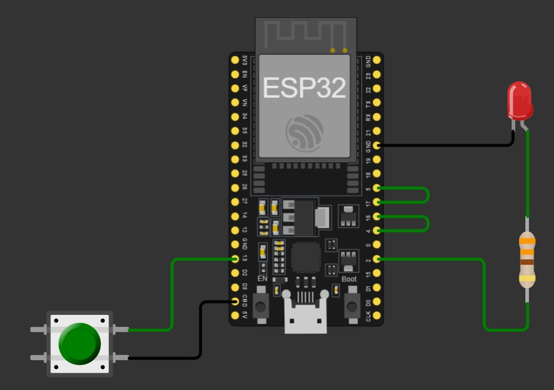

# Aula 7 — UART: Primeiros Bytes

> **Duração estimada:** 30 minutos
> **Bloco:** 3 de 3 — Integração e preparação para UART

---

## Objetivos

Ao final desta aula você será capaz de:

- Explicar o que é comunicação serial UART
- Entender por que o Wokwi exige uma configuração especial (loopback)
- Enviar e receber um byte entre duas UARTs num único ESP32
- Controlar um LED a partir de um byte recebido via UART

---

## 1. Conceito

### O que é UART?

UART significa **Universal Asynchronous Receiver/Transmitter** — em português, Transmissor/Receptor Universal Assíncrono. É uma das formas mais antigas e simples de comunicação serial entre dispositivos.

A ideia é direta: em vez de enviar 8 bits ao mesmo tempo por 8 fios, a UART envia **um bit de cada vez** por um único fio, em sequência. O receptor reconstrói o byte original na outra ponta.

```
Transmissor                         Receptor
    │                                   │
    │  ── TX ──────────────── RX ──►    │
    │  ◄─ RX ──────────────── TX ──     │
    │                                   │
  [envia bits]                    [reconstrói byte]
```

Dois fios de dados: **TX** (transmissão) e **RX** (recepção). A conexão é sempre em **crossover**: TX de um lado vai ao RX do outro.

### Baud rate

A velocidade da UART é medida em **baud** — bits por segundo. Os dois lados precisam usar exatamente o mesmo valor, ou a comunicação falha. O valor mais comum em exemplos didáticos é **9600 bps**.

### O byte que você já conhece

Quando a UART recebe um byte, ele chega em MicroPython como um inteiro — o mesmo tipo que usamos nas aulas anteriores. Tudo que aprendemos sobre bits, máscaras e operadores continua válido aqui.

---

## 2. A limitação do Wokwi — e a solução

> **Leia com atenção antes de montar o circuito.**

No ESP32, a **UART0** é usada pelo Wokwi para o **monitor serial** (o terminal onde você vê os `print()`). Isso significa que ela **não está disponível** para comunicação entre dispositivos — qualquer tentativa de usá-la para outro fim causará conflito.

**Solução adotada: loopback com UART1 e UART2**

Usamos as outras duas UARTs disponíveis no ESP32 e as conectamos **internamente** por fios no próprio diagrama, simulando duas placas:

```
  UART1 (transmissora)          UART2 (receptora)
  TX → GPIO 4    ──────────►   GPIO 16 ← RX
  RX → GPIO 5    ◄──────────   GPIO 17 ← TX
```

A UART1 faz o papel do **transmissor** (quem envia o comando).
A UART2 faz o papel do **receptor** (quem executa a ação).
O monitor serial (UART0) continua disponível para os `print()`.

> **Importante:** nesta configuração, o método `.any()` funciona normalmente
> para UART1 e UART2, pois não há conflito com o monitor serial.
> O conflito ocorre apenas quando se tenta usar UART0 para comunicação
> ao mesmo tempo em que o monitor serial está ativo.

### Na aplicação real (duas placas físicas)

Com hardware real, cada placa tem sua própria UART0 disponível e não há conflito. O código pode usar `uart.any()` normalmente, e as placas se comunicam por fios TX→RX cruzados. Veja a seção 6 desta aula para o esquema de ligação física.

---

## 3. Circuito — Wokwi (loopback)

| Componente | Quantidade |
|------------|------------|
| ESP32 DevKit C V4 | 1 |
| LED vermelho | 1 |
| Resistor 330 Ω | 1 |
| Botão (pushbutton) | 1 |

**Conexões internas (fios no diagrama):**

```
GPIO 4  (TX1) ──────► GPIO 16 (RX2)   ← fio de dados TX→RX
GPIO 17 (TX2) ──────► GPIO 5  (RX1)   ← fio de retorno (opcional)

GPIO 13 ──► Botão ──► GND  (pull-up interno ativado no código)
GPIO 2  ──► R330  ──► LED  ──► GND
```

> O botão usa **pull-up interno** — sem resistor externo necessário.
> `Pin.PULL_UP` garante leitura `1` em repouso e `0` quando pressionado.

A imagem abaixo mostra o circuito montado com os fios de loopback em destaque:



---

## 4. Circuito Wokwi — diagram.json

> Este circuito foi **validado no Wokwi**. Cole o conteúdo abaixo no
> arquivo `diagram.json` do seu projeto.

```json
{
  "version": 1,
  "author": "RMB - Mini Curso Embarcados — Aula 7",
  "editor": "wokwi",
  "parts": [
    {
      "type": "board-esp32-devkit-c-v4",
      "id": "esp",
      "top": 0,
      "left": 0,
      "attrs": { "env": "micropython-20231227-v1.22.0" }
    },
    {
      "type": "wokwi-led",
      "id": "led1",
      "top": 34.8,
      "left": 176.6,
      "attrs": { "color": "red", "flip": "" }
    },
    {
      "type": "wokwi-pushbutton",
      "id": "btn1",
      "top": 198.2,
      "left": -134.4,
      "attrs": { "color": "green", "xray": "1" }
    },
    {
      "type": "wokwi-resistor",
      "id": "r1",
      "top": 158.4,
      "left": 172.25,
      "rotate": 90,
      "attrs": { "value": "330" }
    }
  ],
  "connections": [
    [ "esp:TX",  "$serialMonitor:RX", "", [] ],
    [ "esp:RX",  "$serialMonitor:TX", "", [] ],
    [ "r1:1",    "led1:A",   "green", [ "v-19.2" ] ],
    [ "btn1:2.r","esp:CMD",  "black", [ "h48.2", "v-9.4" ] ],
    [ "esp:4",   "esp:16",   "green", [ "h33.64", "v-9.6" ] ],
    [ "esp:17",  "esp:5",    "green", [ "h33.64", "v-9.6" ] ],
    [ "esp:13",  "btn1:1.r", "green", [ "h-43.01", "v48" ] ],
    [ "r1:2",    "esp:2",    "green", [ "v18", "h-29.35", "v-48" ] ],
    [ "esp:GND.3","led1:C",  "black", [ "h62.44", "h28.4" ] ]
  ],
  "dependencies": {}
}
```

> **Link do projeto Wokwi validado:**
> [https://wokwi.com/projects/462409529242615809](https://wokwi.com/projects/462409529242615809)

---

## 5. Código — Wokwi (loopback)

```python
# ============================================================
# Aula 7 — Loopback UART (simulação Wokwi)
#
# Simula comunicação entre duas UARTs em um único ESP32.
# UART1 (transmissora) envia bytes ao pressionar o botão.
# UART2 (receptora) lê os bytes e controla o LED.
#
# Conexão interna (fios no diagram.json):
#   GPIO 4  (TX1) → GPIO 16 (RX2)
#   GPIO 17 (TX2) → GPIO 5  (RX1)
#
# Protocolo simples:
#   b'\x01' → acende LED
#   b'\x00' → apaga LED
#
# Baud rate: 9600 bps
# ============================================================

from machine import UART, Pin   # type: ignore[import]
import time

# --- configuração das UARTs ---
uart_tx = UART(1, baudrate=9600, tx=4,  rx=5)    # transmissora
uart_rx = UART(2, baudrate=9600, tx=17, rx=16)   # receptora
# Pico: uart_tx = UART(1, baudrate=9600, tx=Pin(4),  rx=Pin(5))
# Pico: uart_rx = UART(0, baudrate=9600, tx=Pin(0),  rx=Pin(1))

# --- periféricos ---
botao = Pin(13, Pin.IN, Pin.PULL_UP)   # pull-up interno: repouso = 1
led   = Pin(2,  Pin.OUT)
led.value(0)
# Pico: botao = Pin(14, Pin.IN, Pin.PULL_UP) | led = Pin(15, Pin.OUT)

# --- estado anterior do botão (detecção de borda) ---
estado_anterior = 1   # repouso com pull-up

print("Aula 7 — Loopback UART iniciado.")
print("Pressione o botão para acionar o LED via UART.")

# --- loop principal ---
while True:

    # ── TRANSMISSORA: detecta mudança de estado do botão ──────────
    estado_atual = botao.value()

    if estado_atual != estado_anterior:       # houve mudança?
        estado_anterior = estado_atual

        if estado_atual == 0:                 # botão pressionado
            uart_tx.write(b'\x01')            # envia byte LIGAR
            print("[TX] Enviou 0x01 → LIGAR")
        else:                                 # botão solto
            uart_tx.write(b'\x00')            # envia byte DESLIGAR
            print("[TX] Enviou 0x00 → DESLIGAR")

    # ── RECEPTORA: lê byte e age ───────────────────────────────────
    if uart_rx.any():                         # há dado disponível?
        dado = uart_rx.read(1)                # lê 1 byte

        if dado == b'\x01':
            led.value(1)
            print("[RX] Recebeu 0x01 → LED LIGADO")
        elif dado == b'\x00':
            led.value(0)
            print("[RX] Recebeu 0x00 → LED DESLIGADO")

    time.sleep(0.02)   # cadência do loop
```

---

## 6. Aplicação real — duas placas físicas

Com duas placas ESP32 físicas, a UART0 de cada placa fica livre para comunicação. Conecte as placas com três fios:

```
Placa A (transmissora)        Placa B (receptora)
   TX (GPIO1) ──────────────► RX (GPIO3)
   RX (GPIO3) ◄────────────── TX (GPIO1)
   GND        ──────────────  GND         ← obrigatório!
```

> **O GND compartilhado é indispensável.** Sem ele, a referência de tensão
> entre as placas é indefinida e a comunicação falha.

**Código — Placa A (transmissora):**

```python
from machine import UART, Pin
import time

uart = UART(0, baudrate=9600)   # UART0 livre na placa física
botao = Pin(13, Pin.IN, Pin.PULL_UP)
estado_anterior = 1

print("Placa A — Transmissora pronta.")

while True:
    estado_atual = botao.value()
    if estado_atual != estado_anterior:
        estado_anterior = estado_atual
        if estado_atual == 0:
            uart.write(b'\x01')
            print("[TX] Enviou 0x01 → LIGAR")
        else:
            uart.write(b'\x00')
            print("[TX] Enviou 0x00 → DESLIGAR")
    time.sleep(0.02)
```

**Código — Placa B (receptora):**

```python
from machine import UART, Pin
import time

uart = UART(0, baudrate=9600)
led  = Pin(2, Pin.OUT)
led.value(0)

print("Placa B — Receptora pronta.")

while True:
    if uart.any():
        dado = uart.read(1)
        if dado == b'\x01':
            led.value(1)
            print("[RX] LED LIGADO")
        elif dado == b'\x00':
            led.value(0)
            print("[RX] LED DESLIGADO")
    time.sleep(0.02)
```

> Use o **Thonny** para gravar e executar os códigos nas duas placas.
> Execute primeiro a Placa B (receptora), depois a Placa A (transmissora).

---

## 7. Experimento

Execute o código de loopback no Wokwi e observe o terminal serial.

**a)** Pressione e solte o botão. Quantas linhas aparecem no terminal a cada ciclo completo?

> _________________________________________________________________

**b)** Complete a tabela com o que você observou:

| Ação | Byte enviado (TX) | LED | Mensagem no terminal |
|------|:-----------------:|:---:|----------------------|
| Botão pressionado | `____` | ____ | _________________ |
| Botão solto       | `____` | ____ | _________________ |

**c)** Por que o código detecta a **mudança** de estado do botão (`estado_atual != estado_anterior`) em vez de simplesmente ler `botao.value()` a cada iteração?

> _________________________________________________________________
> _________________________________________________________________

**d)** O botão usa `Pin.PULL_UP`. Isso significa que em repouso o pino lê `1`. Por que então o código envia `b'\x01'` (LIGAR) quando `estado_atual == 0`?

> _________________________________________________________________

**e)** Troque `b'\x01'` por `b'\x02'` no código e execute. O que acontece? Por quê?

> _________________________________________________________________

---

## 8. Desafio

**Desafio principal:** adicione um segundo LED (GPIO 4) e expanda o protocolo:

| Byte | Ação |
|:----:|------|
| `0x01` | Acende LED 1 |
| `0x00` | Apaga LED 1 |
| `0x03` | Acende LED 2 |
| `0x02` | Apaga LED 2 |

```python
led2 = Pin(4, Pin.OUT)

# dentro do bloco de recepção:
if dado == b'\x03':
    led2.value(1)
    print("[RX] LED2 LIGADO")
elif dado == b'\x02':
    led2.value(0)
    print("[RX] LED2 DESLIGADO")
```

**Desafio bônus:** use dois botões — um para cada LED. Quando o botão A for pressionado, envia o comando para LED1; quando o botão B for pressionado, envia para LED2.

---

## Resumo da aula

- UART transmite um bit de cada vez pelo fio TX, reconstruindo o byte na entrada RX
- Transmissor e receptor devem usar o mesmo **baud rate**
- No Wokwi, UART0 é reservada ao monitor serial — use UART1 e UART2 em loopback
- `.any()` verifica se há dados disponíveis sem bloquear o loop
- Detecção de borda (`estado_atual != estado_anterior`) evita envios repetidos
- Na aplicação real com duas placas, GND compartilhado é obrigatório

---

*← [Aula 6](./aula06-flags-maquina-lavar.md) | Próxima → [Aula 8: UART com Protocolo de Nibbles](./aula08-uart-nibbles.md)*
