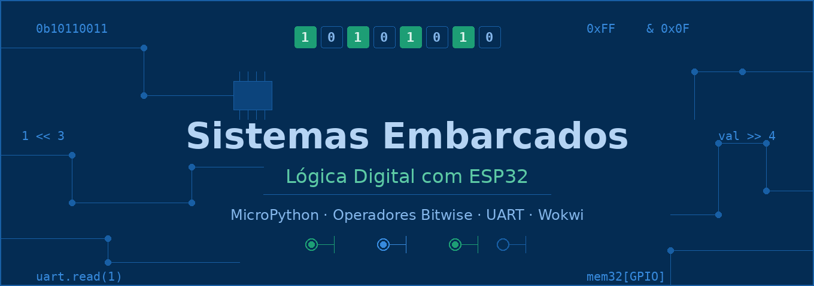

# Sistemas Embarcados — Lógica Digital com ESP32



> Mini curso para o **Curso Técnico em Automação Industrial**
> Plataforma: ESP32 com MicroPython · Simulador: [Wokwi](https://wokwi.com)

---

## Sobre o curso

Este material conduz o aluno desde a leitura e escrita digital básica no ESP32 até a comunicação serial via UART, passando por operadores bitwise, listas, estruturas de repetição, máscaras de bits, escrita direta em registrador de hardware, máquinas de estados e flags.

O objetivo é construir uma base sólida que conecte os conceitos teóricos de **portas lógicas** com a **programação real em hardware embarcado** — tudo simulado no Wokwi, sem necessidade de hardware físico.

---

## Aulas

| # | Título | Operadores | Entregável |
|---|--------|------------|------------|
| [1](./aulas/aula01-leitura-escrita-digital) | Leitura e escrita digital | — | LED controlado por botão |
| [2](./aulas/aula02-operadores-bitwise) | Primeiro operador bitwise em hardware | `&` `\|` `~` | LED responde a 2 botões |
| [3](./aulas/aula03-listas-mascaras) | Listas de pinos e máscara de bits | `&` `\|` com máscara | Banco de 4 LEDs por byte |
| [3 ★](./aulas/aula03-extra-funcoes) | **Extra:** Funções em MicroPython | — | Apoio opcional para a Aula 3 |
| [4](./aulas/aula04-deslocamento-escrita-porta) | Deslocamento e escrita direta em porta | `<<` `>>` `mem32` | Sequenciador de LEDs |
| [5](./aulas/aula05-maquina-estados) | Máquinas de estados: do diagrama ao código | — | Semáforo com 3 estados |
| [6](./aulas/aula06-flags-maquina-lavar) | Flags na prática: máquina de lavar | `\|=` `&=~` `^=` `&` | Sistema com 4 flags simultâneas |
| [7](./aulas/aula07-uart-primeiros-bytes) | UART: primeiros bytes | — | LED controlado via serial |
| [8](./aulas/aula08-uart-nibbles) | UART: protocolo de nibbles | `>>` `&` | Comando + argumento em um byte |

> ★ Aula de apoio — leia antes da Aula 3 se o uso de `def` ainda não for familiar.

---

## Como usar

1. Acesse [wokwi.com](https://wokwi.com) e crie um projeto **ESP32 + MicroPython**
2. Monte o circuito conforme a seção **Circuito** de cada aula
3. Copie o código para o editor e execute
4. Responda as perguntas da seção **Experimento** no seu caderno
5. Tente o **Desafio** antes de avançar para a próxima aula

> Os templates de circuito prontos para o Wokwi estão em [assets/wokwi-links](https://rogeriomb-hub.github.io/minicurso-embarcados/assets/wokwi-links).

---

## Pré-requisito

Saber criar um projeto no Wokwi com ESP32 e abrir o editor MicroPython.

---

## Repositório

O código-fonte deste material está disponível no GitHub e pode ser clonado ou baixado:

```
git clone https://github.com/seu-usuario/minicurso-embarcados.git
```

Contribuições e correções são bem-vindas via *Issues* ou *Pull Requests*.
